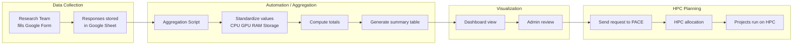

# High Performance Computing Resource Estimation  
### by Neelima Pandey  
CS6999 — Spring 2026  

## Overview  
This project will develop an automated pipeline that consolidates Google Form survey responses for HPC requirements from multiple research teams into standardized, quantitative HPC resource estimates (CPU, GPU type/count, RAM, storage, walltime).

## Problem Statement  
The High Performance Computing (HPC) and storage requirements of HAAG research projects must be identified at the beginning of each semester in order to secure the necessary computational resources. This includes resources accessible to both Georgia Tech researchers and external computational advisors collaborating on these projects.

Currently, information about computational needs is collected from multiple research teams through a survey. However, manually reviewing and consolidating these responses to estimate total CPU, GPU, memory, and storage requirements is time-consuming and error-prone. An automated system is therefore needed to aggregate survey responses, standardize the reported resource needs, and generate a clear summary of computational requirements that can support HPC planning and allocation requests.

## Project Scope

This project addresses the following key questions:

- What information must be collected from research teams to estimate HPC resource requirements reliably?
- How can survey responses be translated into actionable estimates of CPU, GPU, memory, storage, and workload requirements?
- How can this process be standardized into a repeatable workflow that automatically consolidates responses and generates resource summaries?
  

## Status
A survey already exists and will likely need modification based on stakeholder feedback.
[HAAG HPC Resource Estimation Survey](https://docs.google.com/forms/d/e/1FAIpQLScCP9jBCoPDoxk9EOnmLNihqRugzIvQNotvQCJ02VUwvMZkxw/viewform)

## Project Approach

### 1. Improve Data Collection Format
The project will review the existing Google Form and recommend improvements to ensure that resource requirements are captured in structured numeric fields (e.g., GPU count, GPU model, CPU cores, RAM in GB, storage in TB). This will reduce ambiguity and enable reliable automated aggregation.

### 2. Automated Data Aggregation
Survey responses will be automatically consolidated using Google Sheets scripts. The automation will summarize resource requirements across projects, including totals for GPU demand (by type), CPU cores, RAM, and storage.

### 3. Resource Demand Dashboard
A simple dashboard will be created to visualize resource requirements across projects. The dashboard will provide an overview of total resource demand, workload categories, and projected storage needs to support HPC planning.

## Potential Audiences / Use Cases  
1) **New teams** preparing to onboard to HAAG/PACE or request allocations  
2) **Ongoing projects** needing to scale from pilot runs to production  
3) **Returning users** who need a refresh or standardized request format
4) HAAG Admin Team

### Workflow Flowchart

## Deliverables  
- `survey/`  
  - Updated survey questions (Markdown + optional form export)  
- `aggregation/`  
  - Google Sheets script to automatically summarize survey responses and compute total resource demand
- `dashboard/`  
  - Simple dashboard visualizing aggregate resource requirements (GPU, CPU, RAM, storage) across projects
