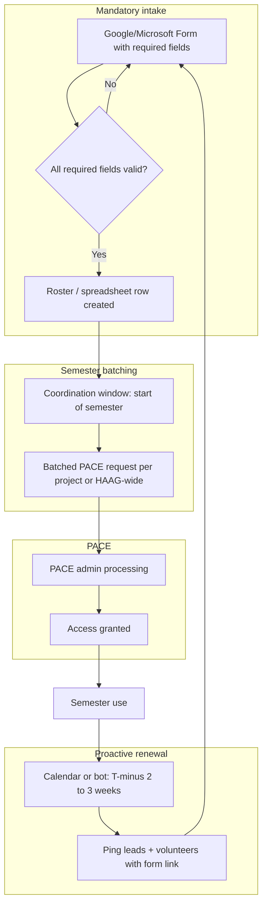

# PACE ICE Volunteer Access — Final Solution & Implementation Guide

**Abhinav Vemuri | Georgia Tech**

This document describes the **complete solution** for standardizing volunteer access to the PACE ICE cluster for HAAG researchers. It incorporates peer review feedback (mandatory intake, proactive renewals, and batched admin requests), defines **who owns what**, and provides an **implementation roadmap** plus a **PowerPoint blueprint** for presenting the initiative.

**Related documentation in this folder**

| File | Purpose |
|------|---------|
| [PACE_ICE_Volunteer_Access_README.md](./PACE_ICE_Volunteer_Access_README.md) | Full standard operating procedure (SOP): eligibility, workflow, templates, troubleshooting |
| [initiative_report.md](./initiative_report.md) | Hypotheses, KPIs, before/after flowcharts |
| [operations_report.md](./operations_report.md) | PM / operations perspective and recurring tasks |

---

## 1. Problem (why this exists)

PACE ICE access is tied to instructional enrollment. When researchers graduate or move to volunteer roles, access drops unless they go through an administrative request path. An informal process produced **incomplete requests**, **skipped steps**, **reactive renewals**, and **PACE admin delays** from one-off tickets scattered across the semester.

---

## 2. Final solution (four pillars)

The finalized design keeps the written SOP as the source of truth and adds **structure that users cannot easily bypass** and **operations that do not depend on memory alone**.

### Pillar A — Mandatory intake (replacing “README-only” checklists)

**Idea:** Replace a passive checklist with a **mandatory Google Form or Microsoft Form** (whichever HAAG standardizes on).

- Required fields match the SOP: full name, GTID, GT email, HAAG project, supervisor / project lead, role (volunteer / collaborator), and access justification.
- Form validation **blocks submission** until every required field is complete, eliminating the “missing info” bottleneck.
- Optional: add short guided text or links (PACE participation page, ICE docs) so users still see context without relying on a separate README pass.

**How this answers “how do you force users to follow the steps?”**

- The **form is the gate**: no complete form → no structured handoff to the next step (see Pillar B).
- Project leads can adopt a simple rule: **PACE tickets or batched emails may only be created from completed form responses** (export or linked spreadsheet), not from ad hoc DMs.

### Pillar B — Semester batching (reducing PACE admin friction)

**Idea:** **Batch** all volunteer access requests at a predictable window (recommended: **first two weeks of the semester** or a fixed calendar week before classes).

- A single coordinator (see Pillar D) collects **approved form submissions** for that window and sends **one consolidated request** to PACE (or a small number of batched tickets grouped by project), instead of many intermittent one-person requests.
- Reduces context switching for PACE admins and aligns with HAAG’s need to clear access in fewer rounds.

**Mid-semester exceptions** (new volunteers, emergency access) can still use the same form, with a labeled “exception / mid-semester” path so metrics stay honest.

### Pillar C — Automated renewal pings (proactive, not reactive)

**Idea:** **Two to three weeks before** the end of each semester (or before the known ICE enrollment reset), send an **automated reminder** to everyone who must renew.

Implementation options (pick one primary, optional secondary):

| Approach | What it does | Owner effort |
|----------|----------------|-------------|
| **Shared calendar series** | Recurring “PACE ICE volunteer renewal” events with invites to project leads + distro list | Low; easy to adopt |
| **Email automation** | Scheduled mail merge or Google/Microsoft automation from a roster | Medium |
| **Chat bot / workflow** (e.g., Slack) | Scheduled message with link to the form and deadline | Medium; needs tooling |

The ping should include: **deadline**, **link to the mandatory form**, **who to contact**, and **what happens if access lapses** (one sentence from the SOP).

**How this answers “who is responsible for remembering renewals?”**

- **Primary operational owner:** a named **Volunteer Access Coordinator** (see Pillar D) is accountable for the calendar/automation and for confirming the ping went out.
- **Secondary ownership:** **project leads** remain accountable for **who** on their team needs access; the automation only ensures they are reminded **before** the cliff, not **after** someone loses login.

### Pillar D — Clear ownership (RACI-style, lightweight)

| Activity | Accountable | Responsible | Consulted | Informed |
|----------|-------------|-------------|-----------|----------|
| Maintaining the form fields & SOP alignment | HAAG leadership / initiative owner | Volunteer Access Coordinator | PACE (as needed) | Project leads |
| Submitting batched access lists each semester | Volunteer Access Coordinator | Project leads (provide names) | PACE | Volunteers |
| Renewals before semester boundary | Volunteer Access Coordinator (reminders) | Project leads (roster accuracy) | — | Volunteers |
| Individual troubleshooting (login, partitions) | Volunteer + project lead | Volunteer | PACE support | Coordinator |

If HAAG is small, **one person** can be Coordinator + PM overlap; still document the role so it survives handoff.

---

## 3. End-to-end flow (final state)

---

## 4. Implementation roadmap

Phases are ordered to deliver **value quickly** while building toward **batching and automation**.

### Phase 0 — Baseline (already largely done)

- Publish and freeze the SOP: [PACE_ICE_Volunteer_Access_README.md](./PACE_ICE_Volunteer_Access_README.md).
- Align project leads on vocabulary (volunteer vs collaborator, required fields).

### Phase 1 — Mandatory form (highest ROI for “missing info”)

**Deliverables**

1. Build Google Form or Microsoft Form with **required** questions mapped 1:1 to the SOP table.
2. Store responses in a spreadsheet or list **restricted to leads/coordinator**.
3. Add a one-line policy: **No PACE ticket without a form row** (except documented emergencies).

**Exit criteria:** At least one full semester where **≥90%** of new volunteer requests arrive via the form (measure via row count vs informal channels).

### Phase 2 — Semester batching

**Deliverables**

1. Pick batch windows (e.g., weeks 1–2 of fall/spring).
2. Coordinator exports form responses for that window and sends **consolidated** PACE communication using your existing email template from the SOP.
3. Document “exception path” for mid-semester adds.

**Exit criteria:** PACE receives **fewer, larger** requests; internal metric: average **requests per volunteer per semester** trending toward **1** batch plus rare exceptions.

### Phase 3 — Renewal automation

**Deliverables**

1. Add semester-end dates to a **shared HAAG calendar** (or automation trigger dates).
2. Schedule invites or emails **2–3 weeks prior** with form link and deadline.
3. Optional: maintain a simple **renewal roster** (names + last renewal semester) in the same spreadsheet as form exports.

**Exit criteria:** Zero reliance on “someone noticed access died” as the primary signal; renewals initiated **before** the reset.

### Phase 4 — Measurement & refinement

**Deliverables**

- Track KPIs from [initiative_report.md](./initiative_report.md): time to submit, incomplete requests, issues reported; add **time to approval** when PACE data is available.
- Quarterly review: adjust form questions, batch timing, or reminder copy.

---

## 5. Metrics to report (for leadership and your deck)

| Metric | Definition | Why it matters |
|--------|------------|----------------|
| Form completion rate | % of access events that start with a full form | Proves enforcement of steps |
| Batched vs ad hoc | Count of PACE submissions that are batched vs one-off | Shows admin load reduction |
| Renewal lead time | Days between reminder and semester end | Proves proactive vs reactive |
| Access downtime incidents | # of volunteers who lost access unexpectedly | Should decrease with Phases 2–3 |

---

## 6. Building the PowerPoint presentation

Use this as a **slide outline**; adapt slide count to your course limits (often 10–15 slides).

### Suggested narrative arc

1. **Title** — Initiative name, your name, HAAG / GT, date.
2. **Context** — ICE is instructional; enrollment-driven access breaks for volunteers after graduation or semester transitions (one diagram from the SOP).
3. **Pain** — Informal process → missing info, delays, inconsistent adoption (reference operations_report / initiative_report bottlenecks).
4. **Goal** — Standardize pipeline so HAAG researchers keep working with minimal friction.
5. **Solution overview** — Four pillars: **Form**, **Batch**, **Remind**, **Own** (one slide with four icons or quadrants).
6. **Mandatory form** — Screenshot mockup of required fields; explicitly tie to “cannot submit incomplete.”
7. **Batching** — Timeline graphic: “Weeks 1–2: collect → one PACE package.”
8. **Renewal pings** — Calendar / automation concept; **who owns renewals** (Coordinator + leads on roster).
9. **Roles** — Simple RACI or table from Section 2 (trim for slides).
10. **Before / after** — Reuse the two flowcharts from [initiative_report.md](./initiative_report.md) (informal vs standardized).
11. **Roadmap** — Phases 1–4 on a horizontal timeline.
12. **KPIs** — What you will measure to prove success.
13. **Risks & mitigations** — Example: “PACE still slow” → batching reduces volume; “people skip form” → leads enforce ticket rule.
14. **Ask / next steps** — What HAAG should approve (form owner, coordinator role, calendar dates).
15. **Q&A / Resources** — Link to this repo folder and PACE URLs from the SOP.

### Design tips

- Keep **one idea per slide**; put extra detail in speaker notes.
- Use **real HAAG anonymized examples** only if policy allows; otherwise use generic placeholders.
- End on **accountability + automation**: humans own rosters; the system enforces completeness and timing.

---

## 7. Summary

The **final solution** is not only documentation—it is **a mandatory form** (so steps cannot be skipped empty-handed), **semester batching** (so PACE admins face fewer round trips), **automated renewal pings** (so memory is not the primary system), and **named ownership** (so everyone knows who runs the calendar and who confirms rosters). Implement in phases, measure KPIs, and tell the story in the deck using the outline above.

For procedural detail (templates, troubleshooting, links), continue to maintain **[PACE_ICE_Volunteer_Access_README.md](./PACE_ICE_Volunteer_Access_README.md)** as the operational SOP alongside this guide.
