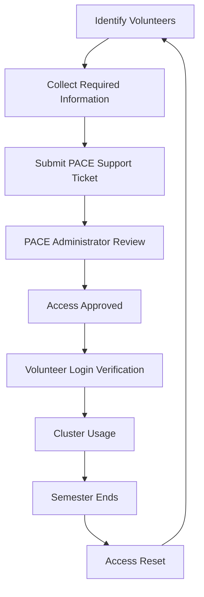
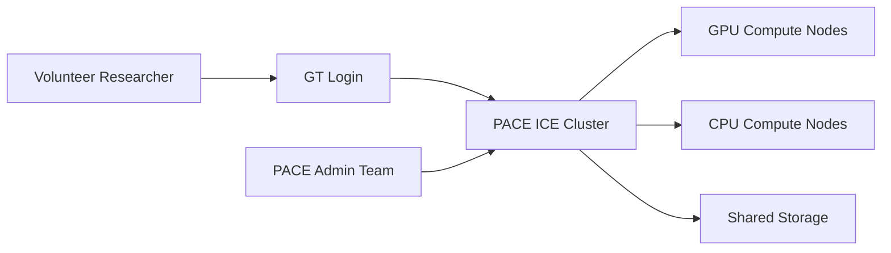

# PACE ICE Volunteer Access Standard Operating Procedure (SOP)

**Abhinav Vemuri | Georgia Tech | Spring 2026**

This repository documents the **standard process for requesting and maintaining volunteer access to the PACE ICE cluster** for HAAG researchers.

The goal of this document is to **eliminate confusion around the volunteer access process** and ensure that graduating researchers, volunteers, and external collaborators can maintain uninterrupted access to HAAG’s primary computing environment.

---

# Table of Contents

1. Overview  
2. Background  
3. Scope of This SOP  
4. Eligibility for Volunteer Access  
5. Required Information for Requests  
6. Volunteer Access Request Workflow  
7. Access Request Lifecycle Diagram  
8. System Architecture Context  
9. Example Access Request Template  
10. Semester Renewal Process  
11. Common Issues and Troubleshooting  
12. Related Resources  
13. Future Improvements  
14. Maintainers  

---

# Overview

The **PACE ICE (Instructional Cluster)** at Georgia Tech is HAAG’s primary computing environment for GPU and CPU workloads.

Access to PACE ICE is normally granted automatically to students enrolled in courses that use the cluster. However, **researchers who graduate or transition to volunteer roles lose their automatic access and must request it through a separate administrative process.**

This document defines the **standard operating procedure (SOP)** for requesting and maintaining volunteer access to PACE ICE.

---

# Background

HAAG uses the **PACE ICE cluster** because it provides:

- Free GPU and CPU resources
- Shared computing infrastructure
- Centralized cluster management
- Integration with Georgia Tech systems

However, because PACE ICE is an **instructional resource**, access is tied to course enrollment and resets between semesters.

This means:

- Graduating students lose cluster access
- Volunteer researchers must request access manually
- Requests must be repeated each semester

Historically this workflow existed informally but **was not documented**, which created delays and confusion.

This SOP formalizes the process.

---

# Scope of This SOP

This SOP standardizes the **PACE ICE volunteer access process for HAAG researchers.**

Covered:

- Volunteer access requests
- Semester access renewal
- Required information for requests
- Troubleshooting common issues

Not Covered:

- Slurm job submission
- Storage allocation management
- PACE training and onboarding
- External HPC resources (ACCESS / NAIRR)

---

# Eligibility for Volunteer Access

Volunteer access may be required for:

### Graduating Researchers
Students who previously had course-based PACE access but continue contributing to HAAG projects.

### Volunteer Contributors
Researchers contributing outside of course enrollment.

### External Collaborators
Comp Advisors or collaborators assisting HAAG projects.

---

# Required Information for Requests

Access requests must include the following information:

| Field | Description |
|------|-------------|
| Full Name | Volunteer researcher |
| GTID | Georgia Tech user ID |
| Email | Georgia Tech email |
| Project | HAAG research project |
| Supervisor | Faculty advisor or project lead |
| Role | Volunteer / collaborator |
| Access Justification | Reason access is required |

Incomplete requests may delay approval.

---

# Volunteer Access Request Workflow

## Step 1 — Identify Volunteers

Before each semester begins, project leads identify volunteers who require access.

## Step 2 — Collect Required Information

Compile required information for all volunteers.

## Step 3 — Submit Access Request

Submit a **PACE support ticket** requesting access.

## Step 4 — Administrator Review

PACE administrators review the request and approve access.

## Step 5 — Verification

Volunteers verify that they can:

- Log into the cluster
- Access required partitions
- Submit jobs successfully

---

# Access Request Lifecycle Diagram

This diagram illustrates the **recurring semester lifecycle of volunteer access**.

---

# System Architecture Context

This shows where volunteer access fits within the broader **PACE ICE infrastructure environment**.

---

# Example Access Request Template

Subject: Request for PACE ICE Volunteer Access

Hello PACE Team,

I am requesting volunteer access to the PACE ICE cluster for the following HAAG researchers.

Name:  
GTID:  
Email:  
Project:  
Supervisor:

These individuals are continuing research work with HAAG and require access to the instructional cluster.

Please let me know if additional information is required.

Thank you.

---

# Semester Renewal Process

Because ICE is tied to instructional enrollment:

1. Access may be removed between semesters.
2. Project leads should review volunteer access before each semester begins.
3. Submit renewal requests early to avoid downtime.
4. Volunteers should verify access after approval.

---

# Common Issues and Troubleshooting

### Access Removed After Semester Change

Cause: ICE enrollment reset.

Solution: Submit volunteer access request.

---

### Unable to Login

Cause: Account permissions pending.

Solution: Wait for confirmation or contact PACE.

---

### Job Submission Errors

Cause: Missing partition permissions.

Solution: Verify cluster access groups.

---

# Related Resources

PACE Website  
https://pace.gatech.edu/

PACE Participation Guide  
https://pace.gatech.edu/participation/

PACE ICE Cluster Docs  
https://pace.gatech.edu/ice-cluster/

PACE Training Videos  
https://mediaspace.gatech.edu/channel/PACE/283315292

---

# Future Improvements

Potential improvements include:

- Automated semester access renewal
- Centralized volunteer access form
- Automated reminder system before semester resets
- Volunteer access dashboard

---

# Maintainers

Abhinav Vemuri  
CS 8803 Leadership in Computer Science  
Georgia Tech
