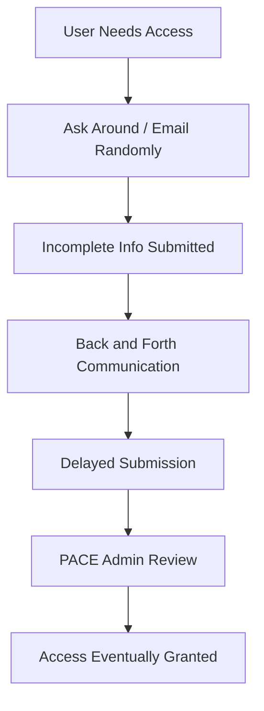
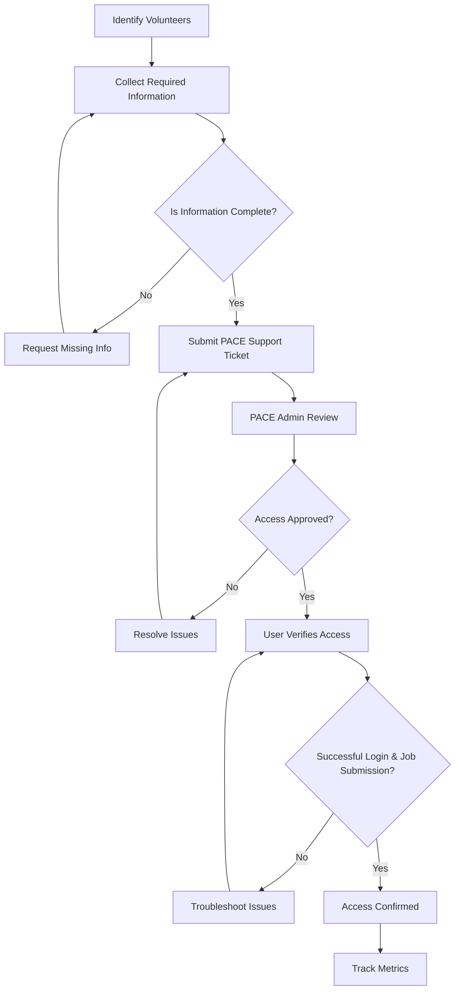

# PACE ICE Volunteer Access SOP — Initiative Report

## Title:
Standardizing Volunteer Access to the PACE ICE Cluster for HAAG Researchers

---

## Initiative Questions

### Describe your initiative / procedure

This initiative focuses on creating a standardized process (SOP) for requesting and maintaining volunteer access to the PACE ICE cluster.

Previously, access to PACE ICE was tied to course enrollment, and when students graduated or transitioned to volunteer roles, they lost access. The process for regaining access was informal and undocumented, which caused delays and confusion.

This SOP formalizes:
- Who qualifies for volunteer access
- What information is required
- The step-by-step request workflow
- The semester renewal process

The goal is to create a consistent and repeatable system that ensures uninterrupted access for HAAG researchers.

---

### Explain the hypotheses / KPIs you have measured and what is left to measure

**Hypotheses:**
- Standardizing the process will reduce access delays  
- Clear documentation will reduce confusion and repeated questions  
- Researchers will successfully maintain access across semesters  

**Current KPIs:**
- Time taken to submit access requests  
- Number of incomplete or incorrect requests  
- Number of access-related issues reported  

**Future KPIs to measure:**
- Time from request submission to approval  
- Number of support tickets related to access issues  
- Percentage of successful semester renewals without interruption  

---

### Explain your method for testing these hypotheses via flowcharts

#### Before SOP (Informal Process)

#### After SOP (Standardized Process)

This comparison allows us to measure improvements in:
- Efficiency (fewer delays)
- Clarity (less confusion)
- Accuracy (complete requests)

---

### Explain how stakeholders are engaging with your initiative

Stakeholders include HAAG researchers, project leads, and PACE administrators.

Engagement has been somewhat indirect. Researchers rely on project leads for guidance, and adoption of the SOP varies. Some users follow the process closely, while others still rely on informal methods.

---

### What processes have you documented to ensure sustainability?

- SOP documentation in GitHub README  
- Workflow steps  
- Required information checklist  
- Troubleshooting steps  

Planned:
- Templates  
- Reminders  
- FAQ  

---

### How are you currently measuring progress toward your goals?

Progress is measured through:
- Fewer incomplete requests  
- More structured submissions  
- Reduced confusion  

---

### What obstacles or bottlenecks have you encountered?

- Users skipping steps  
- Missing info  
- Low visibility of SOP  
- External admin delays  

---

## Summary

This initiative creates a structured system for managing volunteer access. Adoption and visibility are the next steps for improvement.
